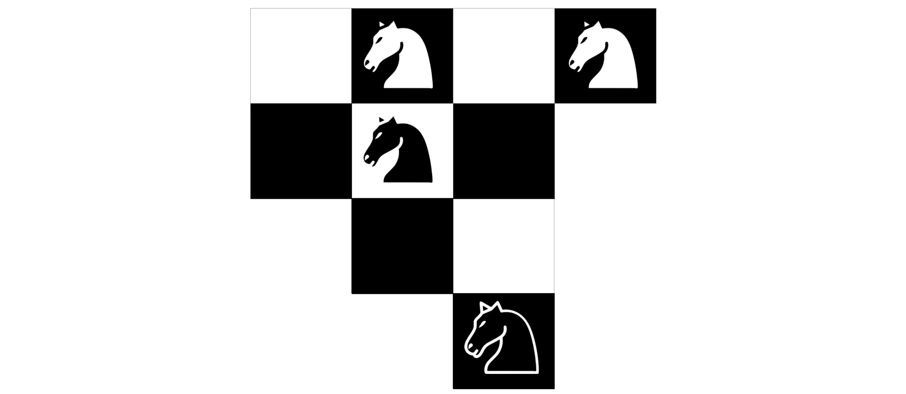
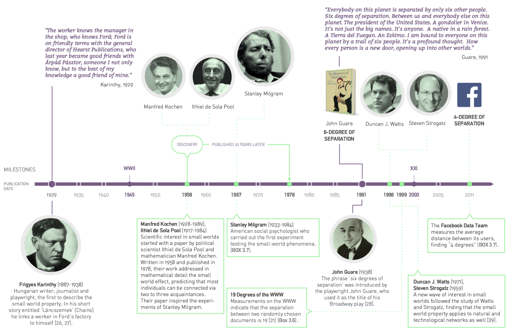

# NetPy '19: Introduction to Network Analysis in Python

###### Workshop instructor

**Asst. Prof. [Lovro Šubelj](http://lovro.lpt.fri.uni-lj.si), PhD**, University of Ljubljana

###### Workshop schedule

Thursday, **19th September 2019 at 3:30 PM** (4 hours with breaks)

###### Workshop location

**Lecture room 3 at [UL FRI](http://www.fri.uni-lj.si)**, Večna pot 113, Ljubljana

###### Materials and forum

+ **GitHub** repository at [**http://github.com/lovre/netpy**](http://github.com/lovre/netpy)
+ **WWW** repository at [**http://lovro.lpt.fri.uni-lj.si/netpy**](http://lovro.lpt.fri.uni-lj.si/netpy)
+ **Piazza** forum at [**http://piazza.com/fri.uni-lj.si/fall2019/netpy**](http://piazza.com/fri.uni-lj.si/fall2019/netpy)

###### High-level description

**The workshop is primarily aimed at Python programmers, either academics, professionals or students, that wish to learn the basics of modern network science and practical analyses of complex real networks, such as social, information and biological networks.** Familiarity with the basics of probability theory, statistics and linear algebra is strongly encouraged.
The workshop is based on the Masters level course [**Introduction to Network Analysis**](http://lovro.lpt.fri.uni-lj.si/posters/frinets.pdf) offered at UL FRI.

###### Recommended prerequisites

**It is recommended that attendees bring a laptop with a working installation of [Python](http://www.python.org), and the [NetworkX](http://networkx.github.io) and [CDlib](http://cdlib.readthedocs.io) packages. Alternatively, you can work with any other network analysis package such as [igraph](http://igraph.org), [graph-tool](http://graph-tool.skewed.de) or [SNAP.py](http://snap.stanford.edu/snappy/).** Finally, for the purposes of visualization of smaller networks, it is recommended to have a working installation of some network analysis software such as [Gephi](http://gephi.org) or [visone](http://visone.info).

###### Tentative syllabus

1. From classical graph theory to **modern network science** (30 min)
2. **Large-scale structure** of real networks and graph **models** (50 min)
3. Measures of **node importance** and link analysis **algorithms** (50 min)
4. Network **community**, **core-periphery** and **equivalence** structure (50 min)
5. Network-based **mining**, **visualization** and practical **applications** (50 min)

+ **Hands-on**: Abstraction, centrality, clusters, mining and visualization.

## Let's start with Guimera's four knights challenge

###### Tentative duration

**5+5 min**

###### Challenge description

**To be revealed in class =)**

## 1. Classical graph theory → modern network science

###### Tentative duration

**10+20 min**

###### Subject description

**TODO**

###### Slides and materials

**TODO**

###### Selected literature

**TODO**

## 2. Large-scale network structure and graph models

###### Tentative duration

**20+30 min**

###### Subject description

**TODO**

###### Slides and materials

**TODO**

###### Hands-on analyses

**TODO**

###### Selected literature

**TODO**

## 3. Measures of node importance and link analysis

###### Tentative duration

**20+30 min**

###### Subject description

**TODO**

###### Slides and materials

**TODO**

###### Hands-on analyses

**TODO**

###### Selected literature

**TODO**

## 4. Clusters of nodes and network mesoscopic structure

###### Tentative duration

**20+30 min**

###### Subject description

**TODO**

###### Slides and materials

**TODO**

###### Hands-on analyses

**TODO**

###### Selected literature

**TODO**

## 5. Network-based mining, visualization and applications

###### Tentative duration

**20+30 min**

###### Subject description

**TODO**

###### Slides and materials

**TODO**

###### Hands-on analyses

**TODO**

###### Selected literature

**TODO**